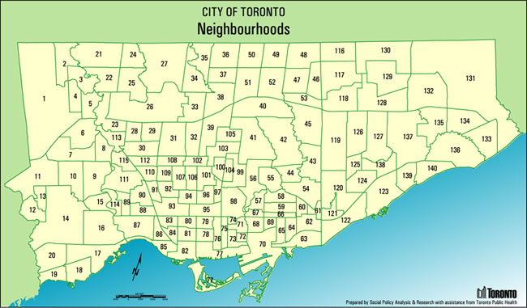

```{r, echo=FALSE, message=FALSE, warning=FALSE}
# echo=FALSE will stop the code chunk from appearing in the knit document
# warning=FALSE and message=FALSE will stop R messages from appearing in the knit document
library(tidyverse)
library(knitr)
auto_thefts <- read_csv("auto_thefts.csv")
neighbourhood_profiles_2016 <- read_csv("neighbourhood_profiles_2016.csv")
```

## Introduction

- <font size="6">**According to the Toronto Police Service, the occurrence of auto theft increased in Toronto over the past few years. **</font>
- <font size="6">**We look at patterns in the distribution of auto thefts to determine how to better distribute the police force to prevent these crimes.**</font>

## Objectives

- <font size="6">**What is the distribution of auto thefts rate looks like among for major neighbourhoods in Toronto?**</font>

- <font size="6">**Are there any outliers?**</font>

- <font size="6">**What factors can be used to predict the auto theft occurrence among neighbourhoods in Toronto?**</font>

## Data Summary - auto_thefts

**More Representative:**

- Only look at data from the past 3 years
- Filtered out all observations that occurred before 2016 in auto_thefts  

```{r, echo=FALSE, message=FALSE, warning=FALSE, fig.height=3}
auto_thefts <- auto_thefts %>%
  filter(occurrenceyear >= 2016)
```

- Phonomenon in some neighbourhoods are abnormal - May be caused by other factors that we cannot find out yet
- We focus on neighbourhoods that have commonalities & filtered out outliers

## Data Summary - Outliers
```{r, echo=FALSE, message=FALSE, warning=FALSE, fig.height=3}
Hood_Overview <- auto_thefts%>%
  group_by(Hood_ID)%>%
  summarise(n_crime=n())%>%
  arrange()
ggplot(data=Hood_Overview,
        aes(x=" ",
            y=n_crime)) +
   geom_boxplot() +
  coord_flip()
IQR <- IQR(Hood_Overview$n_crime)
Outliers_low <- as.numeric(quantile(Hood_Overview$n_crime, c(0.25)) - IQR*1.5)
Outliers_high <- as.numeric(quantile(Hood_Overview$n_crime, c(0.75)) + IQR*1.5)

Hood_Overview <- Hood_Overview %>%
  filter(n_crime <= Outliers_high & n_crime >= Outliers_low)%>%
  arrange(desc(n_crime))
```

- The majority: in the range of 60 to 130
- Observed some outliers that have extremely larger crime occurrrence(7)

## Data Summary - Elders

**neighbourhood_profiles_2016**

- <font size="6">We want to see if there is a relation between the number of auto thefts and the number of elders in the neighbourhood</font>
- <font size="6">We create a new variable called **n_elders** contains the number of residences older than 64</font>
```{r, echo=FALSE, message=FALSE, warning=FALSE, fig.height=3}
neighbourhood_profiles_2016 <- neighbourhood_profiles_2016 %>%
  mutate(n_elders = num_65_84 + num_85plus)
```

## Data Summary - n_crime, auto_theft_rate

According to Toronto Police Service, a crime rate is calculated by dividing the number of reported crimes by the total population, and the result is multiplied by 100,000. We also created a variable called auto_theft_rate.

- Created 3 summaries of auto theft occurrence among neighbourhood for each year
- New variable: n_crime(auto thefts occurrence)
- New variable: auto_theft_rate(crime rate)

```{r, echo=FALSE, message=FALSE, warning=FALSE, fig.height=3}
auto_thefts1 <- inner_join(x = Hood_Overview, y = auto_thefts, by = "Hood_ID")
Hood_crime_2016 <- auto_thefts1%>%
  filter(occurrenceyear == 2016)%>%
  group_by(Hood_ID)%>%
  summarise(n_crime=n())%>%
  arrange()
Hood_crime_2017 <- auto_thefts1%>%
  filter(occurrenceyear == 2017)%>%
  group_by(Hood_ID)%>%
  summarise(n_crime=n())%>%
  arrange()
Hood_crime_2018 <- auto_thefts1%>%
  filter(occurrenceyear == 2018)%>%
  group_by(Hood_ID)%>%
  summarise(n_crime=n())%>%
  arrange()
```

## Data Summary
```{r, echo=FALSE, message=FALSE, warning=FALSE,fig.height=3}
auto_thefts_2016 <- inner_join(x = neighbourhood_profiles_2016, y = Hood_crime_2016, by = "Hood_ID") %>%
  mutate(auto_thefts_rate = n_crime/pop_2016*100000)
auto_thefts_2017 <- inner_join(x = neighbourhood_profiles_2016, y = Hood_crime_2017, by = "Hood_ID") %>%
  mutate(auto_thefts_rate = n_crime/pop_2016*100000)
auto_thefts_2018 <- inner_join(x = neighbourhood_profiles_2016, y = Hood_crime_2018, by = "Hood_ID") %>%
  mutate(auto_thefts_rate = n_crime/pop_2016*100000)
auto_thefts_total <- rbind(auto_thefts_2016, auto_thefts_2017, auto_thefts_2018)
ggplot(data = auto_thefts_2016) +
  labs(x = "pop_2016", title = "Association between population of a neighbourhood and auto thefts occurrence in 2016")+
  aes(x = pop_2016, y = n_crime) +
  geom_point()
```

**pop_2016 and n_crime**

- The scatterplot of population of a neighbourhood and auto thefts occurrence in 2016  
- strong positive linear association. 

## Data Summary
```{r, echo=FALSE, message=FALSE, warning=FALSE,fig.height=3}
ggplot(data = auto_thefts_2016) +
  labs(x = "num_25_to_54", title = "Association between number of people from age 25 to 54 and auto thefts occurrence in 2016")+
  aes(x = num_25_to_54, y = n_crime) +
  geom_point()
```

**num_25_to_54 and n_crime**

- The scatterplot of number of people from age 25 to 54 in a neighbourhood and auto thefts occurrence in 2016  
- strong positive linear correlation. 

## Data Summary

```{r, echo=FALSE, message=FALSE, warning=FALSE,fig.height=3}
ggplot(data = auto_thefts_2016) +
  labs(x = "n_elders", title = "Association between number of people over age 65 and auto thefts occurrence in 2016") +
  aes(x = n_elders, y = n_crime) +
  geom_point()
```

**n_elders and n_crime**

- The scatterplot of number of people over age 65 in a neighbourhood and auto thefts occurrence in 2016  
- moderately strong positive linear correlation. 

## Statistical Methods

**Confidence Interval, Bootstrap Sampling**   

- Estimate the true mean of auto thefts rate among representative neighbourhoods every year
- Simulated 5000 bootstrap samples for auto theft rate of 2016 among neighbourhoods
- 90% confidence level

## Statistical Methods

**Linear Regression**  
Fitted linear regression models using data from 2016 to predict auto theft rate among neighbourhoods.  

- Training data: 80% of data from 3 summaries combined(2016-2018)  
- Testing data: 20% of data from 3 summaries combined(2016-2018)  
- Model A: num_25_to_54 as predictor  
- Model B: n_elders as predictor  
- Model C: pop_2016 as predictor  
- Model D: pop_2016, n_elders, num_25_to_54  

## Results

```{r, echo=FALSE, message=FALSE, warning=FALSE, fig.height=3}
set.seed(222)
n_obs <- 133
total_crime_number <- as.numeric(auto_thefts_2016 %>% summarise(n=n()))
bootprop<-rep(NA,5000)
for (i in 1 :5000)
{
  bootsamp <- auto_thefts_2016 %>% sample_n(size = n_obs,replace=TRUE)
  bootprop[i] <- as.numeric(bootsamp %>%summarise(mean(auto_thefts_rate)))
}
bootprop <- data_frame(pro = bootprop)

#bootstrap of the average crime rate in every neighbourhood of 2018 
quantile5 <- as.numeric(quantile(bootprop$pro, c(0.05)))
quantile95 <- as.numeric(quantile(bootprop$pro, c(0.95)))
bootprop %>% 
  ggplot(aes(x = pro)) + 
  geom_histogram(colour = "black", fill = "grey") +
  labs(x = "Means of auto theft rate from bootstrap samples", title = "Boostrap sampling distribution for the mean of auto theft rate every year")+
  geom_vline(xintercept = quantile5, color = "red") +
  geom_vline(xintercept = quantile95, color = "blue") +
  theme(text=element_text(size = 10))

quantile(bootprop$pro,c(0.05, 0.95))
```

## Results - Models

```{r, echo=FALSE, message=FALSE, warning=FALSE, fig.height = 3}
set.seed(1210);   
n <- nrow(auto_thefts_total) 
training_indices <- sample(1:n, size=round(0.8*n)) 
train <- auto_thefts_total[training_indices,];
y_train <- train$n_crime; 
test <- auto_thefts_total[-training_indices,];
y_test <- test$n_crime; 

modA_train <- lm(n_crime ~ num_25_to_54, data=train)
modB_train <- lm(n_crime ~ n_elders, data=train)
modC_train <- lm(n_crime ~ pop_2016, data=train)
modD_train <- lm(n_crime ~ pop_2016 + n_elders + num_25_to_54 , data=train)
summary(modA_train)$coefficients[,(c(1,4))]
summary(modB_train)$coefficients[,(c(1,4))]
summary(modC_train)$coefficients[,(c(1,4))]
summary(modD_train)$coefficients[,(c(1,4))]

yhat_modA_test <- predict(modA_train, newdata = test)
yhat_modB_test <- predict(modB_train, newdata = test)
yhat_modC_test <- predict(modC_train, newdata = test)
yhat_modD_test <- predict(modD_train, newdata = test)

yhat_modA_train <- predict(modA_train, newdata = train)
yhat_modB_train <- predict(modB_train, newdata = train)
yhat_modC_train <- predict(modC_train, newdata = train)
yhat_modD_train <- predict(modD_train, newdata = train)

modA_test_RMSE <- sqrt(sum((y_test - yhat_modA_test)^2) / nrow(test))
modB_test_RMSE <- sqrt(sum((y_test - yhat_modB_test)^2) / nrow(test))
modC_test_RMSE <- sqrt(sum((y_test - yhat_modC_test)^2) / nrow(test))
modD_test_RMSE <- sqrt(sum((y_test - yhat_modD_test)^2) / nrow(test))
modA_train_RMSE <- sqrt(sum((y_train - yhat_modA_train)^2) / nrow(train))
modB_train_RMSE <- sqrt(sum((y_train - yhat_modB_train)^2) / nrow(train))
modC_train_RMSE <- sqrt(sum((y_train - yhat_modC_train)^2) / nrow(train))
modD_train_RMSE <- sqrt(sum((y_train - yhat_modD_train)^2) / nrow(train))
```
## Results - Models A
```{r, echo=FALSE, message=FALSE, warning=FALSE}
auto_thefts_total %>%
  ggplot(aes(x=num_25_to_54, y=n_crime)) + geom_point() + 
  labs(x = "num_25_to_54", title = "Linear regression model of number of people from age 25 to 54 and auto thefts occurrence for 3 years in total") +
  geom_smooth(method="lm", se=FALSE) + theme_minimal()
```

## Results - Models B
```{r, echo=FALSE, message=FALSE, warning=FALSE}
auto_thefts_total %>%
  ggplot(aes(x=n_elders, y=n_crime)) + geom_point() + 
  labs(x = "n_elders", title = "Linear regression model of number of people over age 65 and auto thefts occurrence for 3 years in total") +
  geom_smooth(method="lm", se=FALSE) + theme_minimal()
```

## Results - Models C
```{r, echo=FALSE, message=FALSE, warning=FALSE}
auto_thefts_total %>%
  ggplot(aes(x=pop_2016, y=n_crime)) + geom_point() + labs(x = "n_elders", title = "Linear regression model of population in 2016 and auto thefts occurrence for 3 years in total") +
  geom_smooth(method="lm", se=FALSE) + theme_minimal()
```

## Discussion - Models

- <font size="6">n_elders vs n_crime has the greatest slope(affects the crime occurrence more than the other factors for each unit increase in population. </font>
- <font size="6">The more elderly, the more the crime occurrence</font>
- <font size="6">Populations with a high elderly count most at risk for crime(require more security personnel)</font>

## Results - RMSE

```{r, echo=FALSE, message=FALSE, warning=FALSE, fig.height = 3}
data_frame(Model = c("A","B","C","D"),
           RMSE_train = c(modA_test_RMSE, modB_test_RMSE, modC_test_RMSE, modD_test_RMSE),
           RMSE_test = c(modA_train_RMSE, modB_train_RMSE, modC_train_RMSE, modD_train_RMSE),           
 ratio_of_RMSEs = RMSE_train / RMSE_test)
```

## Discussion - Best Model

**Model D**

- With n_elders, pop_2016, num_25_to_54 as predictors
- Combines the effects of all three predictors
- Takes the effects of all the different scenarios into account
- Lowest RMSE
- Most useful in predicting future scenarios

Equation: 
 <font size="5">$$n\_crime=\beta_0+\beta_1 pop\_2016 + \beta_2 n\_elders + \beta_3 num\_25\_to\_54$$</font>
 <font size="5">$n\_crime=5.836513198+0.002313230pop\_2016 +$
            $$0.002539183n\_elders + 0.002268608num\_25\_to\_54$$</font>

## Conclusion

**Outliers**

- Hood ID: 1, 14, 21, 26, 27, 119, 130
- Contains similar values for other variables, but considerably higher auto thefts occurrence
- There should always be police stationed in these locations 
- The possible factors that may be responsible for the abnormal outliers are the income, insurance, and proximity to crime inducing businesses (clubs, bars, etc). 

## Outliers - Overview of Neighbourhoods

```{r, echo=FALSE, message=FALSE, warning=FALSE}

```

Credit: City of Toronto

## Conclusion

- <font size="6">The range for mean crime occurrence can help the police make budgets and recruitment accordingly</font>
- <font size="6">E.g. Tackle 80 crimes each year - find which neighbourhood need more protection using estimated mean</font>
- <font size="6">More police should be stationed in populated communities especially in those with a higher proportion of the elderly</font>
